# 基于springboot的购物推荐网站

#### 介绍

本购物推荐网站是基于 Spring Boot 框架开发的一个在线购物平台，旨在为用户提供便捷、高效的购物体验，同时为管理员提供全面、便捷的管理功能。系统拥有管理员和用户两种角色，以满足不同用户群体的需求。

#### 技术栈

后端技术栈：Springboot+Mysql+Maven

前端技术栈：Vue+Html+Css+Javascript+ElementUI

开发工具：Idea+Vscode+Navicate

#### 系统功能介绍

（一）管理员功能模块  
个人中心：管理员可以在此查看和修改个人信息，如用户名、密码、联系方式等，同时能查看操作日志和系统通知。  
用户管理：对用户的基本信息进行管理，包括用户的注册信息、账户状态（是否启用、是否锁定）、用户等级等。管理员可以进行用户信息的新增、修改、删除以及查询操作。  
商品类型管理：负责商品类型的创建、修改和删除，如电子产品、服装、食品等，以便对商品进行分类管理。  
商品信息管理：全面掌控商品的详细信息，包括商品的名称、描述、图片、价格、库存数量、所属类型等。支持商品信息的新增、修改、删除和查询，确保商品信息的准确和及时更新。  
商品销售排行榜管理：实时监控商品的销售情况，生成销售排行榜。可以按照不同的时间段（日、周、月、年）和不同的排序方式（销售额、销售量）进行排行展示，以便管理员了解热门商品和销售趋势。  
系统管理：包括系统参数的设置、权限管理、数据备份与恢复等功能，确保系统的稳定运行和数据安全。  
订单管理：处理用户的订单，包括订单的确认、发货、退款、退货等操作，同时可以查看订单的详细信息和订单状态的统计分析。  

（二）用户功能模块  
商品信息：用户能够浏览各类商品的详细信息，包括图片、描述、价格、用户评价等，方便做出购买决策。  
购物资讯：获取最新的购物优惠活动、新品推荐、时尚潮流等资讯，帮助用户了解市场动态和购物趋势。  
个人中心：管理个人的基本资料，如收货地址、联系方式等。还能查看自己的订单记录、购物车状态、消费历史等。  
订单管理：用户可以查看自己的订单详情，包括订单状态（待付款、已付款、已发货、已完成等）、物流信息等，并可以对未支付的订单进行支付操作，对已完成的订单进行评价。  
购物车：将心仪的商品添加到购物车，方便一次性结算购买，同时可以对购物车中的商品进行数量修改、删除等操作。  

#### 系统作用

（一）对管理员  
提高管理效率：通过集中式的管理功能模块，管理员能够高效地处理用户、商品和订单等相关事务，减少繁琐的手工操作，节省时间和精力。  
优化商品管理：精准地控制商品的类型、信息和库存，根据销售排行榜及时调整商品策略，促进商品的销售和优化库存管理。  
提升用户体验：通过有效的用户管理和订单处理，及时解决用户问题，提高用户满意度，从而增强用户对平台的忠诚度。  
保障系统稳定：通过系统管理功能，确保系统的正常运行，保护数据的安全和完整性，为平台的持续发展提供坚实的技术支持。  

（二）对用户  
便捷购物：用户可以在网站上轻松浏览丰富的商品信息，随时随地进行购物，不受时间和空间的限制。  
个性化推荐：根据用户的浏览和购买历史，为用户提供个性化的商品推荐，提高购物的效率和满意度。  
及时资讯获取：了解最新的购物资讯和优惠活动，能够更好地规划购物预算，享受更多的实惠。  
订单跟踪与管理：方便地跟踪订单状态，管理个人购物记录，为后续的购物决策提供参考。  

#### 系统功能截图

代码结构

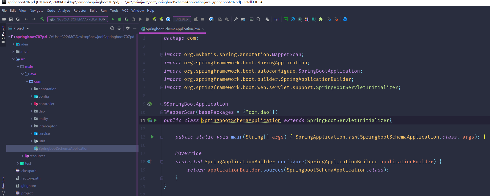

数据库表

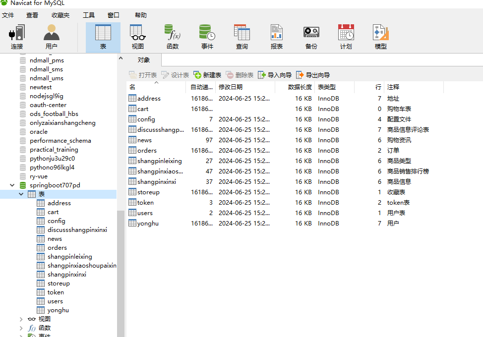

登录

用户后台管理

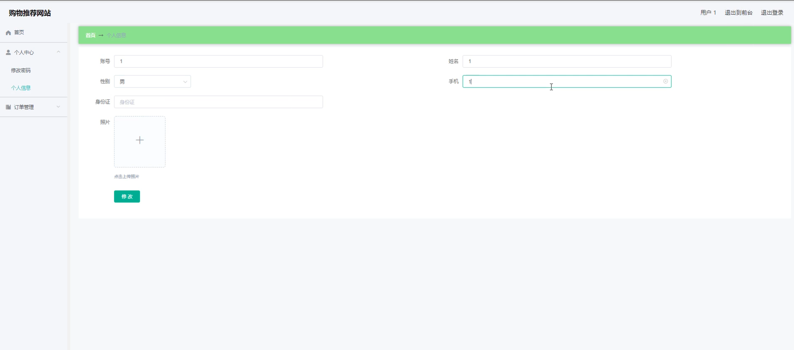

管理员端后台管理

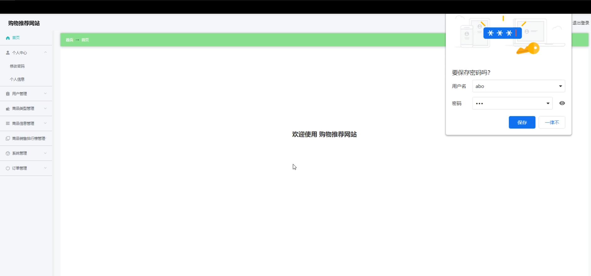

用户管理

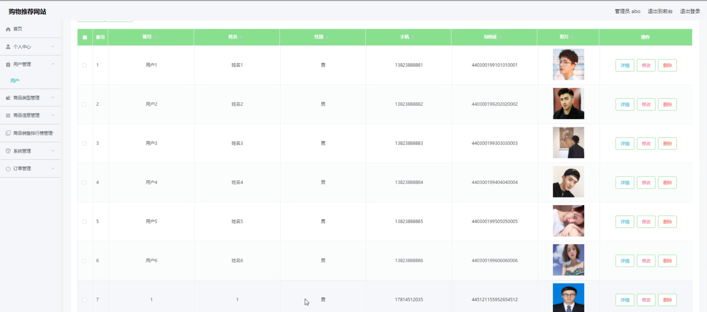

商品信息管理

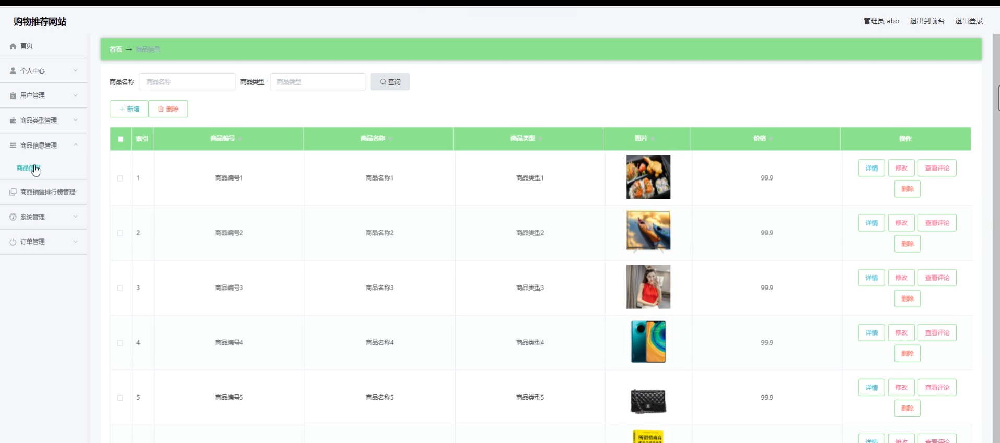

商品销售排行榜管理

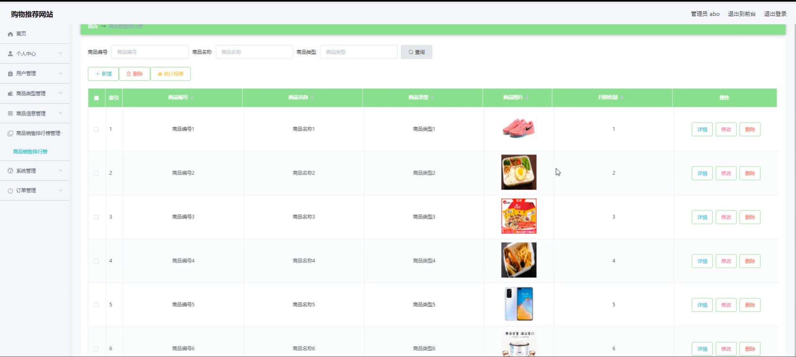

系统管理

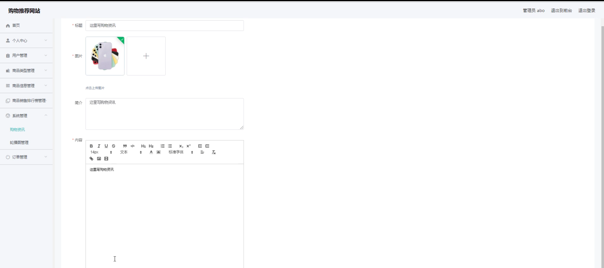

前台页面首页

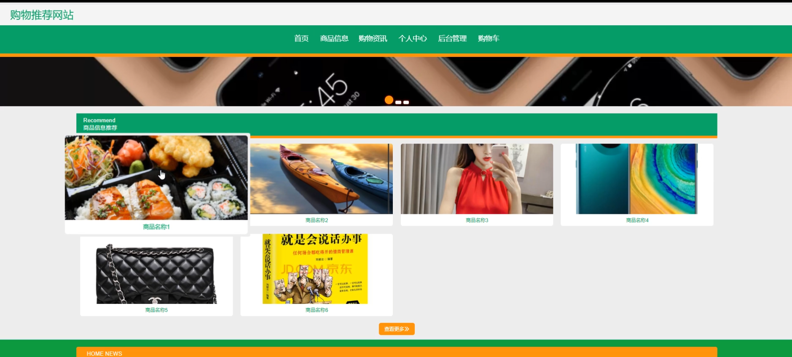

购物车

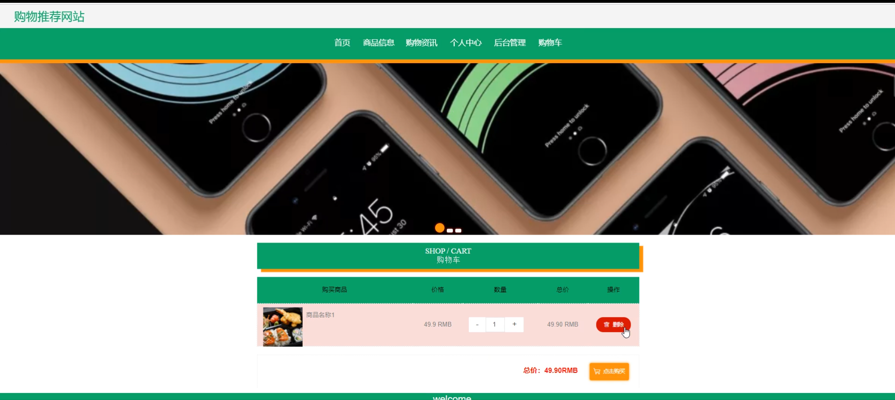

个人中心

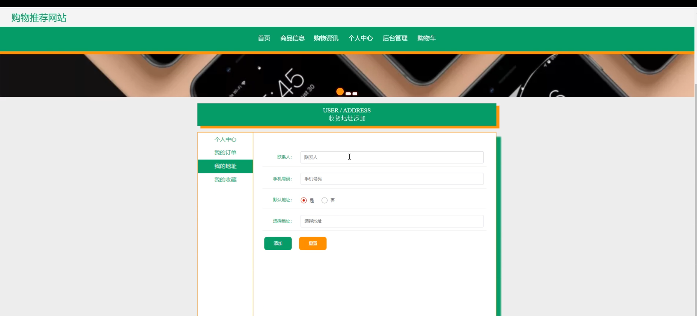

订单管理

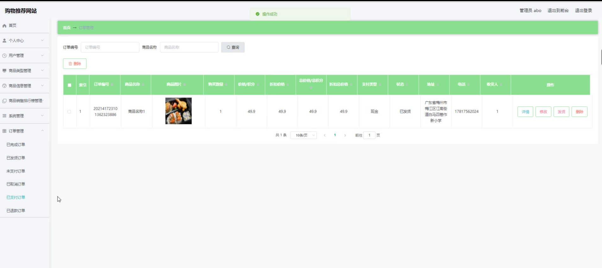

#### 总结

本基于 Spring Boot 的购物推荐网站通过清晰的角色划分和丰富的功能模块，为管理员提供了高效的管理工具，为用户创造了便捷、个性化的购物环境。通过不断优化和改进，有望在电子商务领域取得良好的业绩，为用户和管理员带来更多的价值。

#### 使用说明

创建数据库，执行数据库脚本 修改jdbc数据库连接参数 下载安装maven依赖jar 启动idea中的springboot项目

后台地址：http://localhost:8080/springboot707pd/admin/dist/index.html

管理员  abo 密码 abo

前台地址：http://localhost:8080/springboot707pd/front/index.html

